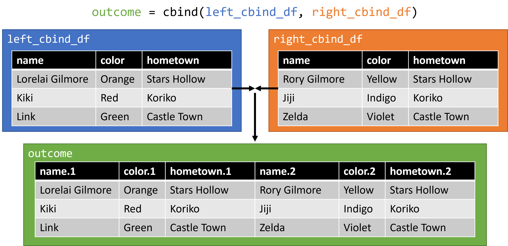
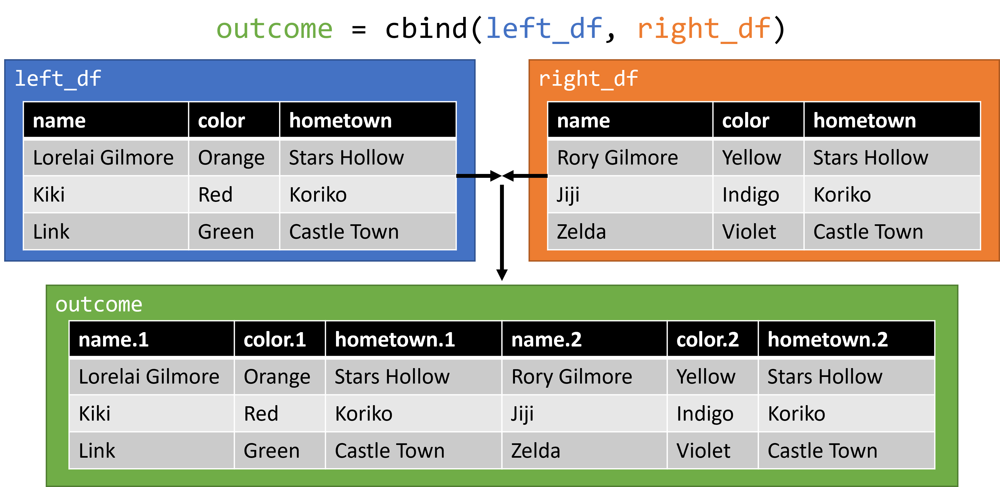

```{r setup, include=FALSE}
# Set knitr options
knitr::opts_chunk$set(echo = TRUE, warning = FALSE, out.width = "70%", fig.align = "center")

# Load packages
# No packages needed, but you will need knitr (part of R markdown)
```

# Overview

This R Markdown file will walk students through the process of 

**Prerequisites**

* A stable internet connection
* A working installation of R and an IDE (Rstudio or Jupyter)
* Working knowledge of R syntax and data structures 

**Teaching Objectives**

By the end of this lecture, students should be able to:

* Remember common functions used when joining dataframes in R
* Understand the example data in its current format, and the shape of the desired outcome
* Apply the provided code to the example problems
* Analyze a new dataset and suggest courses of action for joining

**Roadmap**

1. 

**Scenario**

We want to end up with a single dataframe, that has one row for each duo pair, one column for each member, and one column for their hometown.

```{r, fig.cap="Desired Output Example", fig.alt="A dataframe with 5 columns titled member 1, member 1 color, member 2, member 2 color, and hometown", echo = FALSE}
knitr::include_graphics("./img/0_1_output.png")
```


# Workspace Preparation

Please make sure your working directory is set to the base directory of this project (where the `teaching_demonstration_jnjoseph.Rmd` file is). You can set this automatically if you are using R studio by opening the `teaching_demo_proj.Rproj` file. If you are not, please use the `setwd()` function.

After your working directory is set, please run the following code to download our class data, and prepare it for the lesson.

```{r}
# Load in student survey csv
.raw_survey = read.csv("https://docs.google.com/spreadsheets/d/1E8ME8ldv8Pv4-saL-ZYHJckmVPNgcNd53LasYiW0jwU/export?format=csv&usp=sharing", header = TRUE, stringsAsFactors = FALSE)

# Use me if something goes wrong
# .raw_survey = read.csv()

# Let loose the data gremlins
# Don't look at this file until after lecture! Here there be spoilers.
source("./src/1_split_duos.R")
```


# Exploring the Data

Our duos were split, and individuals were cast off into to different locations (dataframes), named `desert` and `swamp`. Let's start by looking at them. Each dataframe has 4 columns: the name of the individual, a color, the name of their alter (pairing), and their hometown.

Starting with the `desert`:

```{r}
head(desert, 10)
str(desert)
```

And then the `swamp`:

```{r}
head(swamp, 10)
str(swamp)
```

---

**Checkpoint**

1. What do you notice about these dataframes? Does anything surprise you?
2. Considering our desired output, do you have any ideas regarding how we can join these dataframes?
3. What, if any, manipulations do you think we will need to perform before we can try and merge the data?

---

# Joining Data in the Abstract

Our eventual goal is to join the two dataframes above, and have a single row for each duo pair, one column for each member, and one column for their hometown. How can we get there? Let's look at a few possibilities.

## Join by row using `cbind`

The simplest way to join two dataframes is to just attach the columns of one dataframe to the columns of another using `cbind` or *column bind*. Presented in the figure below are two mini-dataframes, similar to our example data, being merged in such a way.

```{r, fig.cap="`cbind` example 1", fig.alt="Two dataframes that merge well using the cbind function", echo = FALSE}

```

This method can work, but you must be very confident about the structure of your data. For example, in the following figure, what issues do you expect to run into with this method?

```{r, fig.cap = "`cbind` example 2", fig.alt = "Two dataframes with misaligned data", echo = FALSE}

```

## Joins using `merge`

`cbind` may work in some situations, but is very "brittle" -- or easy to break -- with any changes to the data. A more reliable method of merging makes use of a common *key* between two sources of data. The *key* can be anything, like a numerical ID or a string, but they must always be unique. Joins that use the key method will be familiar to anyone who has used SQL in the past, as they follow the same naming convention as in that language.

### Inner Join

An *inner join* tries to join two sets of data using a common *key*, keeping only the data that exists in both of the original data sets. This is commonly illustrated using a venn diagram similar to the one below. Only the area highlighted with green will be included in the output.

```{r, fig.cap = "Inner Join - Venn Diagram", fig.alt = "A venn diagram with circles labeled data 1 and data 2. The intersection of them is highlighted with the text 'inner join'", echo = FALSE}
knitr::include_graphics("./img/2_1_inner.png")
```

In the context of our data, it might look something like the following if we use hometown as our key:

```{r, fig.cap = "Inner Join - Example Data", fig.alt = "Two dataframes being joined by common hometowns, removing cases where there is no hometown match", echo = FALSE}
knitr::include_graphics("./img/2_2_inner.png")
```

We can see that when using an *inner join*, cases where **both** dataframes have a single row with our key will be matched and joined into a single output dataframe. However, if there are rows in **either** data frame without a match, those rows will be dropped from our data.

### Outer Join

An *Outer Join* is the opposite of an *inner join*. Rather than just looking for those rows which have a *key* in common, it will join every row, regardless of the *keys*, inserting blank values where there is no match. You can get a sense of this merge with the venn diagram below, where the green indicates good matches, while the orange indicates partial matches.

```{r, fig.cap = "Outer Join - Venn Diagram", fig.alt = "A venn diagram with circles labeled data 1 and data 2. The intersection of them is highlighted in green, while the edges are highlighted in orange", echo = FALSE}
knitr::include_graphics("./img/3_1_outer.png")
```

In the context of our data, an *outer join* may look something like the following, again using hometown as our key:

```{r, fig.cap = "Outer Join - Example Data", fig.alt = "Two dataframes being joined by common hometowns, adding rows for cases with no matches, but introducing NAs", echo = FALSE}

```

In this example, we see that an *outer join* will keep all available cases, but we introduce `NA` values into the resulting dataframe where no match could be made. This may or may not be an issue depending on what the next steps are.

### Left Join

A *left join* allows you to pick one of the two dataframes you are joining and prioritize it. It essentially takes all of the cases in the dataframe on the 'left' side, and searches in 'right' dataframe to join what it can. Keeping with the venn diagram representations, it would look like the following:

```{r, fig.cap = "Left Join - Venn Diagram", fig.alt = "A venn diagram with circles labeled data 1 and data 2. All of the data 1 circle is highlighted, but only the part od data 2 that intersects data 1 is highlighted", echo = FALSE}

```

Using our example data, a *left join* would look like this:

```{r, fig.cap = "Left Join - Example Data", fig.alt = "Two dataframes being joined by common hometowns, keeping all of the left dataframe data, and adding the right dataframe data when available", echo = FALSE}
knitr::include_graphics("./img/4_2_left.png")
```

We can see that while all of the data from our 'left' side is preserved, unmatched data on the 'right' is discarded. You can also technically do a *right join*, which will do the same thing with sides reversed, but moving your prioritized data set to the left is more common.

---

**Checkpoint**

1. What is the difference between a *column bind* and a *key* based join?
2. What is the difference between an *inner join*, *outer join*, and *left join*?

---

# Key Selection and Creation

Now that we have a few possible tools, we can start considering how we are going to join our duos back together. Let's glance back at our `desert` and `swamp` dataframes to get an idea of what we're working with.

```{r}
head(desert, 10)
head(swamp, 10)
```

In order to join these dataframes and reunite our duos, we need to choose some method to match on. For this activity, we will be using one of the *key* based methods we covered above. However, data is rarely in a clean and usable state from the start. Often the bulk of your time will be spent preparing the data to do the actual task you want to accomplish.

---

**Checkpoint**

1. What column do you think could serve as a key for us to join on?
2. What if any manipulations will you need to do for the key to be usable?

---


Joining on one variable,


joining on multiple variables

learning checks


# Mid-Class Break -------------------------------------

pause and stretch, stop for questions

# Real-World Application


