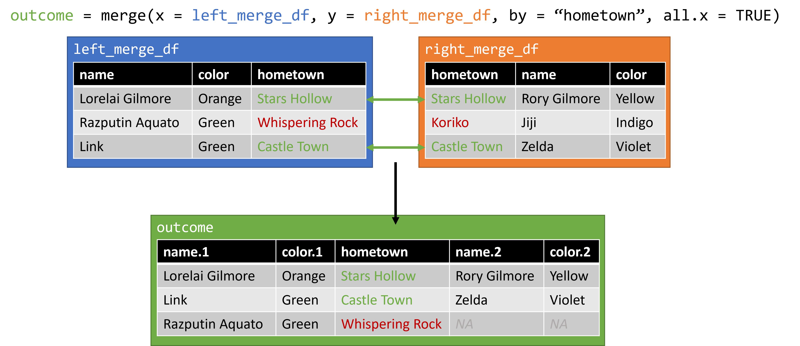

```{r setup, include=FALSE}
# Set knitr options
knitr::opts_chunk$set(echo = TRUE, warning = FALSE, out.width = "70%", fig.align = "center")

# Load packages
# No packages needed, but you will need knitr (part of R markdown)
```

# Overview

This lesson will guide students through the process of merging two messy dataframes by a common *key* using `merge`. 

**Prerequisites**

* A stable internet connection
* A working installation of R and an IDE (Rstudio or Jupyter)
* Working knowledge of R syntax and data structures 

**Teaching Objectives**

By the end of this lecture, I want you to be able to:

* Remember common functions used when joining dataframes in R
* Understand the example data in its current format, and the shape of the desired outcome
* Apply the provided code to the example problems
* Analyze a new dataset and suggest courses of action for joining

**Roadmap**

1. Example introduction.
2. Data exploration and problem formulation.
3. Merge toolkit.
4. Example problem.
5. Break and reflection.
6. Real-world application.

# Tools for Joining Data

Our goal today is to learn how to merge two tables, or dataframes, in R. There a number of different ways to do so, depending on what you want your final output to look like. Below, we will go through some of the most common methods to merge dataframes. 

If you would like to test these dataframes within R yourself, you can run this code to get the dataframes used in the examples. The results will be identical to the figures.

```{r}
source("https://raw.githubusercontent.com/Epsian/table_join_lecture/main/src/2_merge_examples.R")
```

## Join Vertically using `rbind`

If you have two dataframes and want to combine them, you need to decide what direction you want to combine them in. If you would like to combine them vertically, or stack the rows on top of each other, you can use `rbind` or *row bind*. `rbind` is helpful if you have two dataframes with the same columns, and you want to combine the cases (rows). However, it will not work if the columns are different. `rbind` accepts an arbitrary number of dataframes, here we use two: `upper_rbind_df` and `lower_rbind_df`.

```{r, eval=FALSE}
outcome = rbind(upper_rbind_df, lower_rbind_df) 
```

```{r, fig.cap="`rbind` example 1", fig.alt="Two dataframes that merge well bertically using the rbind function", echo = FALSE}

```

## Join Horizontally using `cbind`

If you would like to combine two dataframes horizontally, so that you add more columns on to a dataframe, you can use `cbind` or *column bind*. The `cbind` function takes an arbitrary number of dataframes as it's arguments. We'll provide just our two here, but try repeating one multiple times if you would like to see what happens.

```{r, eval=FALSE}
outcome = cbind(left_cbind_df, right_cbind_df) 
```

```{r, fig.cap="`cbind` example 1", fig.alt="Two dataframes that merge well horizontally using the cbind function", echo = FALSE}
knitr::include_graphics("./img/1_2_cbind.png")
```

We can see out new `outcome` dataframe was created as expected. This method can work, but you must be very confident about the structure of your data. For example, in the following figure, what issues do you expect to run into with this method?

```{r, fig.cap = "`cbind` example 2", fig.alt = "Two dataframes with misaligned data", echo = FALSE}

```

## Joins using `merge`

`cbind` may work in some situations, but is very "brittle" -- or easy to break -- with any changes to the data. A more reliable method of merging makes use of a common *key* between two sources of data. The *key* can be anything, like a numerical ID or a string, but they must always be unique. Joins that use the key method will be familiar to anyone who has used SQL in the past, as they follow the same naming convention as in that language.

### Inner Join

An *inner join* tries to join two sets of data using a common *key*, keeping only the data that exists in both of the original data sets. This is commonly illustrated using a venn diagram similar to the one below. Only the area highlighted with green will be included in the output.

```{r, fig.cap = "Inner Join - Venn Diagram", fig.alt = "A venn diagram with circles labeled data 1 and data 2. The intersection of them is highlighted with the text 'inner join'", echo = FALSE}
knitr::include_graphics("./img/2_1_inner.png")
```

In the context of our data, it might look something like the following if we use hometown as our key. We can use the following code to do an *inner merge* using the `merge` function. The `merge` function in R requires two arguments, `x` and `y`, which are the dataframes we would like to merge. We will be using `left_merge_df` and `right_merge_df`, and asking merge to use `hometown` as the key to merge by.

```{r, eval=FALSE}
outcome = merge(x = left_merge_df, y = right_merge_df, by = "hometown") 
```

```{r, fig.cap = "Inner Join - Example Data", fig.alt = "Two dataframes being joined by common hometowns, removing cases where there is no hometown match", echo = FALSE}
knitr::include_graphics("./img/2_2_inner.png")
```

Everything seems in order. We can see that when using an *inner join*, cases where **both** dataframes have a single row with our key will be matched and joined into a single output dataframe. However, if there are rows in **either** data frame without a match, those rows will be dropped from our data.

### Outer Join

An *Outer Join* is the opposite of an *inner join*. Rather than just looking for those rows which have a *key* in common, it will join every row, regardless of the *keys*, inserting blank values where there is no match. You can get a sense of this merge with the venn diagram below, where the green indicates good matches, while the orange indicates partial matches.

```{r, fig.cap = "Outer Join - Venn Diagram", fig.alt = "A venn diagram with circles labeled data 1 and data 2. The intersection of them is highlighted in green, while the edges are highlighted in orange", echo = FALSE}
knitr::include_graphics("./img/3_1_outer.png")
```

In the context of our data, an *outer join* may look something like the following, again using hometown as our key. The code for an *outer join* is similar to an *inner join*, with one addition. We will want to specify that `all = TRUE`, essentially saying we want everything included.

```{r, eval=FALSE}
outcome = merge(x = left_merge_df, y = right_merge_df, by = "hometown", all = TRUE)
```

```{r, fig.cap = "Outer Join - Example Data", fig.alt = "Two dataframes being joined by common hometowns, adding rows for cases with no matches, but introducing NAs", echo = FALSE}
knitr::include_graphics("./img/3_2_outer.png")
```

In this example, we see that an *outer join* will keep all available cases, but we introduce `NA` values into the resulting dataframe where no match could be made. This may or may not be an issue depending on what your next steps are.

### Left Join

A *left join* allows you to pick one of the two dataframes you are joining and prioritize it. It essentially takes all of the cases in the dataframe on the 'left' side, and searches in 'right' dataframe to join what it can. Keeping with the venn diagram representations, it would look like the following:

```{r, fig.cap = "Left Join - Venn Diagram", fig.alt = "A venn diagram with circles labeled data 1 and data 2. All of the data 1 circle is highlighted, but only the part od data 2 that intersects data 1 is highlighted", echo = FALSE}
knitr::include_graphics("./img/4_1_left.png")
```

Using our example data, a *left join* would look like this. The R code is similar, to the previous examples, but we specify that instead of `all = TRUE`, we just want `all.x = TRUE`. Recall that in the function call, `x` is the first dataframe, or the "left" one.

```{r, eval=FALSE}
outcome = merge(x = left_merge_df, y = right_merge_df, by = "hometown", all.x = TRUE) 
```

```{r, fig.cap = "Left Join - Example Data", fig.alt = "Two dataframes being joined by common hometowns, keeping all of the left dataframe data, and adding the right dataframe data when available", echo = FALSE}

```

We can see that while all of the data from our 'left' side is preserved, unmatched data on the 'right' is discarded. You can also technically do a *right join*, which will do the same thing with sides reversed, but moving your prioritized data set to the left is more common.

If you were coding along, you can clean up our environment using the following code:

```{r}
rm(outcome, upper_rbind_df, lower_rbind_df, left_cbind_df, right_cbind_df, left_merge_df, right_merge_df)
```

---

<div style="background:#addfad; padding: 5px;">

**Checkpoint**

Please use the Zoom reacts to respond. Green check is TRUE, red X is FALSE.

1. `cbind` sorts rows before combining dataframes.
2. An *outer join* of two dataframes of equal rows will produce an outcome with the same number of rows.

</div>

---

# Data Merge Practice

To practice with some of the tools we learned above, we will work with some example data together. The fun part is, the data will be generated by you! Please use the following link and fill out the Google form.

**Class Data Generation**

[Link to the Google Form](https://docs.google.com/forms/d/e/1FAIpQLScbEy7y5dqZKJ73oDiRFC8trCnhibfHEQW_061slrEou2mrBg/viewform)

**Workspace Preparation**

Please run the following code to download our class data, and prepare it for the lesson.

```{r}
# Load in student survey csv
.raw_survey = read.csv("https://docs.google.com/spreadsheets/d/1E8ME8ldv8Pv4-saL-ZYHJckmVPNgcNd53LasYiW0jwU/export?format=csv&usp=sharing", header = TRUE, stringsAsFactors = FALSE)

# Let loose the data gremlins
# Don't look at this file until after lecture! Here there be spoilers.
source("https://raw.githubusercontent.com/Epsian/table_join_lecture/main/src/1_split_duos.R")
```

## The Scenario

After sending out invitations via our Google form, all of our favorite duos from history and fiction have agreed to come to lecture. On their way, the group was beset by data gremlins, resulting in all of our duos being separated! Not only that, but the gremlins have introduced noise and mess into our data.

The individuals from our duos have regathered themselves in two locations (dataframes), `california` and `massachusetts`. Every duo wants to find their way back home, and to reunite with their opposite. 

Let's start by looking at the dataframes where the individuals from our duos ended up. Each dataframe has 4 columns: the name of the individual, a color, the name of their alter (pairing), and their hometown.

Starting with the `california`:

```{r}
head(california, 10)
str(california)
```

And then the `massachusetts`:

```{r}
head(massachusetts, 10)
str(massachusetts)
```

We want, by the end of this lesson, to reunite our duos. To do so, we will want to create a new dataframe, where each row has a single duo pair: one column for each member, their associated color, and hometown. And example of our desired output can be seen here.

```{r, fig.cap="Desired Output Example", fig.alt="A dataframe with 5 columns titled member 1, member 1 color, member 2, member 2 color, and hometown", echo = FALSE}
knitr::include_graphics("./img/0_1_output.png")
```

---

<div style="background:#addfad; padding: 5px;">

**Checkpoint**

1. Considering our desired output, do you have any thoughts regarding how we can join these dataframes?
2. What, if any, manipulations do you think we will need to perform before we can try and merge the data?

</div>

---

## Key Creation

In order to join these dataframes and reunite our duos, we need to choose some method to match on. For this activity, we will be using one of the *key* based methods we covered above. However, data is rarely in a clean and usable state from the start. Often the bulk of your time will be spent preparing the data to do the actual task you want to accomplish.

For our example, we will be using the "hometown" as our matching *key*; we ultimately want all of our duos to get home! However, the data gremlins have made this task more difficult, as the hometowns have various noise in them that prevents us from using them as a *key*. We're going to have to repair the damage before we can reunite our duos.

---

<div style="background:#addfad; padding: 5px;">

**Checkpoint**

1. What do we need to do to make "hometown" a usable *key* to match on?

</div>

---

**Spoiler Space**

Don't scroll past here until you've answered the above questions!

<br>
<br>
<br>
<br>
<br>
<br>
<br>
<br>
<br>
<br>
<br>
<br>
<br>
<br>
<br>

To use "hometown" as a *key*, we will need to standardize the capitalization and the space deliminators. Let's take care of the capitalization first.

While we could spend time making sure all of our hometowns are properly capitalized, it isn't really necessary in this application; we just need them to match. An easy way to do that is to set everything to upper or lower case. Let's use lower case here, making use of the `tolower` function in R. It will convert any character vector into all lower case.

```{r}
california$hometown = tolower(california$hometown)
massachusetts$hometown = tolower(massachusetts$hometown)
```

Let's pause to look at our work ...

```{r}
head(california, 10)
```

Looks good. Now let's deal with the spacing. If you look at our dataframes and compare across them, you'll notice some hometowns have underscores in them. This seems to only happen when there would be a space. We can use that rule to replace all the underscores with a space instead. To do this, we'll use a `gsub` function, or "global substitution." It will look over all of the strings, and globally replace a pattern we specify with a substitution. In this case, we want to replace all "_" with " ".

```{r}
# gsub(Pattern, replacement, X)
# pattern is what we want to replace
# replacement is what we want to replace the pattern
# X is the vector of character strings we want to run this replacement on
california$hometown = gsub(pattern = "_", replacement =  " ", x = california$hometown)
massachusetts$hometown = gsub(pattern = "_", replacement = " ", x = massachusetts$hometown)
```

Let's check our work ...

```{r}
head(california, 10)
```

Looking good! It seems we have a consistent key. Now for the ultimate task of reuniting our duos.

## Format and Merge

Unfortunately, our duos were not split evenly. Some duos both got sent to the same place, while others were sent to different places. As with many data science problems, there are a number of ways to overcome this, and no "best" answer.

---

<div style="background:#addfad; padding: 5px;">

**Checkpoint**

1. How would you prepare our dataframes for a clean merge, now that we have a good key?

</div>

---

**Spoiler Space**

Don't scroll past here until you've answered the above questions!

<br>
<br>
<br>
<br>
<br>
<br>
<br>
<br>
<br>
<br>
<br>
<br>
<br>
<br>
<br>

I'll walk you through one method, but stress that this is not an "optimal" answer, it is just one of many. For my solution, I will aggregate all of the individuals into one dataframe, and then split them so that each new dataframe has only one instance of each hometown.

First, I'll combine all my individuals using `rbind` from earlier.

```{r}
# combine all out individuals into one dataframe
individuals = rbind(massachusetts, california)
```

Now all of our individuals are in a single dataframe. Our next task is to split them evenly, so one member of each duo, by hometown, is in a separate dataframe. For this we can make use of the `duplicated` function. `duplicated` checks if a specific value has appeared already within a vector. For example, if you had a vector of `c("A", "B", "B", "C", "D", "C")`, the second B and second C would be considered duplicated, and thus output `TRUE` while all other values would output `FALSE`.

In our case, if we run duplicated over the `hometown` column for our individuals, and split the `TRUE` into one datafarme and `FALSE` into another, we should end up with two dataframes, each containing one individual from a hometown. Let's give it a try. First, let's see what it looks like when we run `duplicated`. We'll assign it to our individuals dataframe so it is easier to see.

```{r}
# run duplicated over hometowns and assign as a new column in our individuals dataframe
individuals$duplicated = duplicated(individuals$hometown)

# show the dataframe
individuals
```

Looks good! Now we can use that new column to evenly split our dataframe, and them cleanly pair our duos back together! We can split them using the `duplicated` column we just made.

```{r, fig.cap = "Split via `duplicated`", fig.alt = "Two dataframes being split based on the column 'duplicated'", echo = FALSE}

```

```{r}
# assign to a new duo1 dataframe, the contents of dataframe "individuals"
# SUCH THAT
# the rows whose value in column `individuals$duplicated` is equal to TRUE
# and give me all columns
duo1 = individuals[individuals$duplicated == TRUE, ]

# assign to a new duo1 dataframe, the contents of dataframe "individuals"
# SUCH THAT
# the rows whose value in column `individuals$duplicated` is equal to TRUE
# and give me all columns
duo2 = individuals[individuals$duplicated == FALSE, ]
```

Alright, now we have two dataframes, each containing one member of a duo. Time to finally merge them back together! We can do this using the `merge` function we learned about previously. Let's try an *inner merge*.

```{r}
# assign to a new reunion dataframe
# the result of a inner merge between dataframes `duo1` and `duo2`
# using column "hometown" as the key
reunion = merge(duo1, duo2, by = "hometown")

# show results
reunion
```

A bit messy still, but we did it! Each duo has been reunited in one row. Now we can clean up the results a bit, and arrive at our desired outcome. You'll notice some column names now have a ".x" or ".y" at the end. This is because in the original `duo` dataframes, the columns had the same name. Since two columns can't have the same name once we join them in a single dataframe, the `merge` function add these suffixes to denote which column came from which dataframe. The columns from the first dataframe in the `merge` function always gets the ".x" ending, while the second gets the ".y" ending.

```{r}
# first let's keep only the columns we want
# assign to new dataframe `outcome` the contents of `reunion`
# SUCH THAT
# all rows
# and the columns are named 
outcome = reunion[ , c("name.x", "color.x", "name.y", "color.y", "hometown")]
```

Lastly, we can rename our columns.

```{r}
# rename columns of dataframe `outcome`
colnames(outcome) = c("mem_1", "mem_1_color", "mem_2", "mem_2_color", "hometown")

# show results
head(outcome, 10)
```

---

<div style="background:#addfad; padding: 5px;">

**Checkpoint**

1. Is there anything from the above section you still have questions about?
2. Now that we've gotten to the outcome, would you have tried anything differently?

</div>

---

# Real-World Application

That was hopefully a fun spreadsheet-based adventure, and I'm glad it had a happy ending. But how can we use what we've learned in the real world? The inspiration for this lesson came from a task I needed to accomplish for a student organization I helped run, called [Hack 4 California](https://critical-data-analysis.org/). The lab would meet weekly to work on civic data projects for our community, from small projects like helping the campus food pantry with usage statistics, and to full-fledged examinations of government data regarding exposure to hazardous materials in prisons with collaborators at UCLA.

To continue learning from the experience, my co-lead and I wanted to calculate attendance, and reach out to everyone who had participated to ask them what they thought! However, we had an issue. Because of the pandemic, half of our attendance data was in PDFs of excel sheets, and the other half was in zoom attendance logs. In total we had two PDFs, and 28 Zoom logs. You can see versions of these files with fake names below.

```{r, fig.cap = "PDF Attendance Data", fig.alt = "A PDF of a spreadsheet with dates as columns containing names", echo = FALSE, out.extra="style='border-style: solid;border-width: 5px;'"}
knitr::include_graphics("./img/attentance_sheet_pdf.jpg")
```

```{r, fig.cap = "Zoom Log Attendance Data", fig.alt = "A spreadsheet log of of zoom attendance with names, times, and metadata", echo = FALSE}
knitr::include_graphics("./img/attentance_sheet_zoom.jpg")
```

The data formats are not ideal (Why PDFs of an excel sheet?), but such is the case with most projects. You can import versions of these dataframes to work with using the following code:

```{r}
source("https://raw.githubusercontent.com/Epsian/table_join_lecture/main/src/3_real_examples.R")
```

## Data Challenge

We wanted to create a single dataframe that contained complete attendance data, so that we could see how many times each person attended. Using the skills you've learned in this lecture and the course so far, create a single dataframe which contains a row for each person, and columns containing their name, a count of how many times they attended, and their email if available.

**Tips**

1. Create a mock up of your desired output, work towards that goal.
2. What information do you need to keep from the raw data?
3. What do you think you can use to merge on? What obstacles are there to doing so?
4. How will you need to format the data so you can merge? What are the rows and columns?


