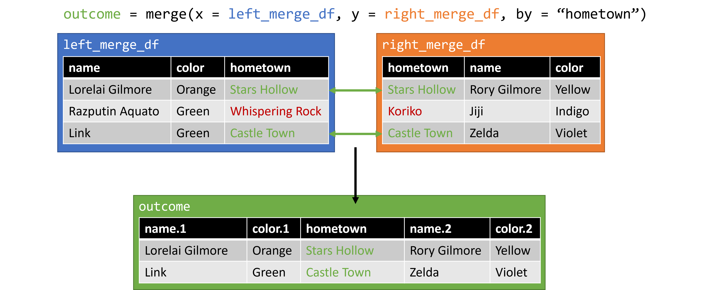

```{r setup, include=FALSE}
# Set knitr options
knitr::opts_chunk$set(echo = TRUE, warning = FALSE, out.width = "70%", fig.align = "center")

# Load packages
# No packages needed, but you will need knitr (part of R markdown)
```

# Overview

This lesson will guide students through the process of merging two messy dataframes by a common key using `merge`. 

**Prerequisites**

* A stable internet connection
* A working installation of R and an IDE (Rstudio or Jupyter)
* Working knowledge of R syntax and data structures 

**Teaching Objectives**

By the end of this lecture, students should be able to:

* Remember common functions used when joining dataframes in R
* Understand the example data in its current format, and the shape of the desired outcome
* Apply the provided code to the example problems
* Analyze a new dataset and suggest courses of action for joining

**Roadmap**

1. Example introduction.
2. Data exploration and problem formulation.
3. Merge toolkit.
4. Example problem.
5. Break and reflection.
6. Real-world application.

**Scenario**

Our gathering of famous duos has been beset by data goblins, resulting in all of our duos being separated! They have gathered together in two locations (dataframes), the desert and the swamp. Every duo wants to find their way back home, and to reunite with their opposite. 

Practically, we want to use the data provided to produce a single dataframe, that has one row for each duo pair, one column for each member, their associated color, and hometown. And example of our desired output can be seen here.

```{r, fig.cap="Desired Output Example", fig.alt="A dataframe with 5 columns titled member 1, member 1 color, member 2, member 2 color, and hometown", echo = FALSE}

```


# Workspace Preparation

Please run the following code to download our class data, and prepare it for the lesson.

```{r}
# Load in student survey csv
.raw_survey = read.csv("https://docs.google.com/spreadsheets/d/1E8ME8ldv8Pv4-saL-ZYHJckmVPNgcNd53LasYiW0jwU/export?format=csv&usp=sharing", header = TRUE, stringsAsFactors = FALSE)

# Let loose the data gremlins
# Don't look at this file until after lecture! Here there be spoilers.
source("https://raw.githubusercontent.com/Epsian/table_join_lecture/main/src/1_split_duos.R")
```

# Exploring the Data

Our duos were split, and individuals were cast off into to different locations (dataframes), named `desert` and `swamp`. Let's start by looking at them. Each dataframe has 4 columns: the name of the individual, a color, the name of their alter (pairing), and their hometown.

Starting with the `desert`:

```{r}
head(desert, 10)
str(desert)
```

And then the `swamp`:

```{r}
head(swamp, 10)
str(swamp)
```

---

**Checkpoint**

1. What do you notice about these dataframes? Does anything surprise you?
2. Considering our desired output, do you have any ideas regarding how we can join these dataframes?
3. What, if any, manipulations do you think we will need to perform before we can try and merge the data?

---

# Joining Data in the Abstract

Our eventual goal is to join the two dataframes above, and have a single row for each duo pair, one column for each member, and one column for their hometown. How can we get there? Let's look at a few possibilities.

First, run this code to generate a few example dataframes for merging:

```{r}
source("https://raw.githubusercontent.com/Epsian/table_join_lecture/main/src/2_merge_examples.R")
```

## Join by row using `cbind`

The simplest way to join two dataframes is to just attach the columns of one dataframe to the columns of another using `cbind` or *column bind*. Presented in the figure below are two mini-dataframes, similar to our example data, being merged in such a way.

```{r, fig.cap="`cbind` example 1", fig.alt="Two dataframes that merge well using the cbind function", echo = FALSE}
knitr::include_graphics("./img/1_1_cbind.png")
```

Let's try it ourselves. Let's use `cbind` to merge the `e1_cbind` and `e2_cbind` dataframes together into a new `e3_cbind` dataframe. the `cbind` function takes an arbitrary number of dataframes as it's main arguments. We'll provide just our two here, but repeating one multiple times if you would like to see what happens.

```{r}
# cbind the dataframes
e3_cbind = cbind(e1_cbind, e2_cbind)

# preview output
e3_cbind
```

We can see out new `e3_cbind` dataframe was created as expected. This method can work, but you must be very confident about the structure of your data. For example, in the following figure, what issues do you expect to run into with this method?

```{r, fig.cap = "`cbind` example 2", fig.alt = "Two dataframes with misaligned data", echo = FALSE}
knitr::include_graphics("./img/1_2_cbind.png")
```

## Joins using `merge`

`cbind` may work in some situations, but is very "brittle" -- or easy to break -- with any changes to the data. A more reliable method of merging makes use of a common *key* between two sources of data. The *key* can be anything, like a numerical ID or a string, but they must always be unique. Joins that use the key method will be familiar to anyone who has used SQL in the past, as they follow the same naming convention as in that language.

### Inner Join

An *inner join* tries to join two sets of data using a common *key*, keeping only the data that exists in both of the original data sets. This is commonly illustrated using a venn diagram similar to the one below. Only the area highlighted with green will be included in the output.

```{r, fig.cap = "Inner Join - Venn Diagram", fig.alt = "A venn diagram with circles labeled data 1 and data 2. The intersection of them is highlighted with the text 'inner join'", echo = FALSE}
knitr::include_graphics("./img/2_1_inner.png")
```

In the context of our data, it might look something like the following if we use hometown as our key:

```{r, fig.cap = "Inner Join - Example Data", fig.alt = "Two dataframes being joined by common hometowns, removing cases where there is no hometown match", echo = FALSE}

```

Let's try it ourselves. We can use the following code to do an *inner merge* using the `merge` function. The `merge` function in R requires two arguments, `x` and `y`, which are the dataframes we would like to merge. We will be using `e1_key` and `e2_key`, and asking merge to use `hometown` as the key to merge by. We'll assign our output to a new dataframe, `e3_inner`.

```{r}
# inner join using "hometown"
e3_inner = merge(x = e1_key, y = e2_key, by = "hometown")

# preview output
e3_inner
```

Everything seems in order. We can see that when using an *inner join*, cases where **both** dataframes have a single row with our key will be matched and joined into a single output dataframe. However, if there are rows in **either** data frame without a match, those rows will be dropped from our data.

### Outer Join

An *Outer Join* is the opposite of an *inner join*. Rather than just looking for those rows which have a *key* in common, it will join every row, regardless of the *keys*, inserting blank values where there is no match. You can get a sense of this merge with the venn diagram below, where the green indicates good matches, while the orange indicates partial matches.

```{r, fig.cap = "Outer Join - Venn Diagram", fig.alt = "A venn diagram with circles labeled data 1 and data 2. The intersection of them is highlighted in green, while the edges are highlighted in orange", echo = FALSE}
knitr::include_graphics("./img/3_1_outer.png")
```

In the context of our data, an *outer join* may look something like the following, again using hometown as our key:

```{r, fig.cap = "Outer Join - Example Data", fig.alt = "Two dataframes being joined by common hometowns, adding rows for cases with no matches, but introducing NAs", echo = FALSE}
knitr::include_graphics("./img/3_2_outer.png")
```

Let's try it. The code for an *outer join* is similar to an *inner join*, with one addition. We will want to specify that `all = TRUE`, essentially saying we want everything included. let's assign our output to `e3_outer`.

```{r}
# inner join using "hometown"
e3_outer = merge(x = e1_key, y = e2_key, by = "hometown", all = TRUE)

# preview output
e3_outer
```

In this example, we see that an *outer join* will keep all available cases, but we introduce `NA` values into the resulting dataframe where no match could be made. This may or may not be an issue depending on what your next steps are.

### Left Join

A *left join* allows you to pick one of the two dataframes you are joining and prioritize it. It essentially takes all of the cases in the dataframe on the 'left' side, and searches in 'right' dataframe to join what it can. Keeping with the venn diagram representations, it would look like the following:

```{r, fig.cap = "Left Join - Venn Diagram", fig.alt = "A venn diagram with circles labeled data 1 and data 2. All of the data 1 circle is highlighted, but only the part od data 2 that intersects data 1 is highlighted", echo = FALSE}
knitr::include_graphics("./img/4_1_left.png")
```

Using our example data, a *left join* would look like this:

```{r, fig.cap = "Left Join - Example Data", fig.alt = "Two dataframes being joined by common hometowns, keeping all of the left dataframe data, and adding the right dataframe data when available", echo = FALSE}
knitr::include_graphics("./img/4_2_left.png")
```

The R code is similar, to the previous examples, but we specify that instead of `all = TRUE`, we just want `all.x = TRUE`. Recall that in the function call, `x` is the first dataframe, or the "left" one. We'll assign this output to `e3_left`.

```{r}
# inner join using "hometown"
e3_left = merge(x = e1_key, y = e2_key, by = "hometown", all.x = TRUE)

# preview output
e3_left
```

We can see that while all of the data from our 'left' side is preserved, unmatched data on the 'right' is discarded. You can also technically do a *right join*, which will do the same thing with sides reversed, but moving your prioritized data set to the left is more common.

---

**Checkpoint**

Let's clean up our environment a bit using the following code:

```{r}
rm(e1_cbind, e2_cbind, e3_cbind, e1_key, e2_key, e3_inner, e3_outer, e3_left)
```

1. What is the difference between a *column bind* and a *key* based join?
2. What is the difference between an *inner join*, *outer join*, and *left join*?

---

# Key Selection

Now that we have a few possible tools, we can start considering how we are going to join our duos back together. Let's glance back at our `desert` and `swamp` dataframes to get an idea of what we're working with.

```{r}
head(desert, 10)
head(swamp, 10)
```

In order to join these dataframes and reunite our duos, we need to choose some method to match on. For this activity, we will be using one of the *key* based methods we covered above. However, data is rarely in a clean and usable state from the start. Often the bulk of your time will be spent preparing the data to do the actual task you want to accomplish.

---

**Checkpoint**

1. What column do you think could serve as a key for us to join on?
2. What if any manipulations will you need to do for the key to be usable?

---

**Spoiler Space**

Don't scroll past here until you've answered the above questions!

<br>
<br>
<br>
<br>
<br>
<br>
<br>
<br>
<br>
<br>
<br>
<br>
<br>
<br>
<br>

# Key Creation

For our example, we will be using the hometown as out matching key; we ultimately want all of our duos to get home! However, the data gremlins have made this task more difficult, as the hometowns have various noise in them that prevents us from using them as a key. We're going to have to repair the damage before we can reunite our duos.

We need to make our hometowns exact between out duos to use them as a key. To do this, we will need to standardize the capitalization, and the space deliminators in the hometown column. Let's take care of the capitalization first.

While we could spend time making sure all of our hometowns are properly capitalized, it isn't really necessary in this application; we just need them to match. An easy way to do that is to set everything to upper or lower case. Let's use lower case here, making use of the `tolower` function in R. It will convert any character vector into all lower case.

First for the desert:

```{r}
desert$hometown = tolower(desert$hometown)
```

And then the swamp:

```{r}
swamp$hometown = tolower(swamp$hometown)
```

Let's pause to look at our work ...

```{r}
head(desert, 10)
```

Looks good. Now let's deal with the spacing. If you look at our dataframes and compare across them, you'll notice some hometowns have underscores in them. This seems to only happen when there would be a space. We can use that rule to replace all the underscores with a space instead. To do this, we'll use a `gsub` function, or "global substitution." It will look over all of the strings, and globally replace a pattern we specify with a substitution. In this case, we want to replace all "_" with " ".

```{r}
# gsub(Pattern, replacement, X)
# pattern is what we want to replace
# replacement is what we want to replace the pattern
# X is the vector of character strings we want to run this replacement on
desert$hometown = gsub(pattern = "_", replacement =  " ", x = desert$hometown)
```

And now the swamp:

```{r}
swamp$hometown = gsub(pattern = "_", replacement = " ", x = swamp$hometown)
```

Let's check our work ...

```{r}
head(desert, 10)
```

Looking good! It seems we have a consistent key. Now for the ultimate task of reuniting our duos.

# Format and Merge

Unfortunately, our duos were not split evenly. Some duos both got sent to the same place, while others were sent to different places. As with many data science problems, there are a number of ways to overcome this, and no "best" answer.

---

**Checkpoint**

1. How would you prepare our dataframes for a clean merge, now that we have a good key?

---

**Spoiler Space**

Don't scroll past here until you've answered the above questions!

<br>
<br>
<br>
<br>
<br>
<br>
<br>
<br>
<br>
<br>
<br>
<br>
<br>
<br>
<br>

I'll walk you through one method, but stress that this is not an "optimal" answer, it is just one of many. For my solution, I will aggregate all of the individuals into one dataframe, and then split them so that each new dataframe has only one instance of each hometown.

First, I'll combine all my individuals. You can add on rows to a dataframe using `rbind` much the same way you can add on columns using `cbind` in R. However, `rbind` is typically less fraught, as rows are typically conceptualized as individual and independent of each other, unlike columns which typically show data about rows. `rbind` essentially stacks two dataframes on top of each other, or appends the rows of one dataframe to another.

```{r}
# combine all out individuals into one dataframe
individuals = rbind(swamp, desert)
```

Now all of our individuals are in a single dataframe. Our next task is to split them evenly, so one member of each duo, by hometown, is in a separate dataframe. For this we can make use of the `duplicated` function. `duplicated` checks if a specific value has appeared already within a vector. For example, if you had a vector of `c("A", "B", "B", "C", "D", "C")`, the second B and second C would be considered duplicated, and thus output `TRUE` while all other values would output `FALSE`.

In our case, if we run duplicated over the `hometown` column for our individuals, and split the `TRUE` into one datafarme and `FALSE` into another, we should end up with two dataframes, each containing one individual from a hometown. Let's give it a try. First, let's see what it looks like when we run `duplicated`. We'll assign it to our individuals dataframe so it is easier to see.

```{r}
# run duplicated over hometowns and assign as a new column in our individuals dataframe
individuals$duplicated = duplicated(individuals$hometown)

# show the dataframe
individuals
```

Looks good! Now we can use that new column to evenly split our dataframe, and them cleanly pair our duos back together! First let's evenly split them:


```{r}
# assign to a new duo1 dataframe, the contents of dataframe "individuals"
# SUCH THAT
# the rows whose value in column `individuals$duplicated` is equal to TRUE
# and give me all columns
duo1 = individuals[individuals$duplicated == TRUE, ]

# assign to a new duo1 dataframe, the contents of dataframe "individuals"
# SUCH THAT
# the rows whose value in column `individuals$duplicated` is equal to TRUE
# and give me all columns
duo2 = individuals[individuals$duplicated == FALSE, ]
```

Alright, now we have two dataframes, each containing one member of a duo. Time to finally merge them back together! We can do this using the `merge` function we learned about previously. Let's try an *inner merge*.

```{r}
# assign to a new reunion dataframe
# the result of a inner merge between dataframes `duo1` and `duo2`
# using column "hometown" as the key
reunion = merge(duo1, duo2, by = "hometown")

# show results
reunion
```

A bit messy still, but we did it! Each duo has been reunited in one row. Now we can clean up the results a bit, and arrive at our desired outcome. You'll notice some column names now have a ".x" or ".y" at the end. This is because in the original `duo` dataframes, the columns had the same name. Since two columns can't have the same name once we join them in a single dataframe, the `merge` function add these suffixes to denote which column came from which dataframe. The columns from the first dataframe in the `merge` function always gets the ".x" ending, while the second gets the ".y" ending.

```{r}
# first let's keep only the columns we want
# assign to new dataframe `outcome` the contents of `reunion`
# SUCH THAT
# all rows
# and the columns are named 
outcome = reunion[ , c("name.x", "color.x", "name.y", "color.y", "hometown")]
```

Lastly, we can rename our columns.

```{r}
# rename columns of dataframe `outcome`
colnames(outcome) = c("mem_1", "mem_1_color", "mem_2", "mem_2_color", "hometown")

# show results
head(outcome, 10)
```

---

**Checkpoint**

1. Is there anything from the above section you still have questions about?
2. Now that we've gotten to the outcome, would you have tried anything differently?

---

# Real-World Application

That was hopefully a fun spreadsheet-based adventure, and I'm glad it had a happy ending. But how can we use what we've learned in the real world? The inspiration for this lesson came from a task I needed to accomplish for a student organization I helped run, called [Hack 4 California](https://critical-data-analysis.org/). The lab would meet weekly to work on civic data projects for our community, from small projects like helping the campus food pantry with usage statistics, and to full-fledged examinations of government data regarding exposure to hazardous materials in prisons with collaborators at UCLA.

To continue learning from the experience, my co-lead and I wanted to reach out to everyone who had participated, and ask them what they thought! However, we had an issue. Because of the pandemic, half of our data were in PDFs of excel sheets, and the other half were in zoom attendance logs. In total I had two PDFs, and 28 Zoom logs. You can see versions of these files with fake names below.

```{r, fig.cap = "PDF Attendance Data", fig.alt = "A PDF of a spreadsheet with dates as columns containing names", echo = FALSE, out.extra="style='border-style: solid;border-width: 5px;'"}

```

```{r, fig.cap = "Zoom Log Attendance Data", fig.alt = "A spreadsheet log of of zoom attendance with names, times, and metadata", echo = FALSE}
knitr::include_graphics("./img/attentance_sheet_zoom.jpg")
```

The data formats are not ideal (Why PDFs of an excel sheet?), but such is the case with most projects. You can download simplified versions of these data to work with using the following code:

```{r}

```


